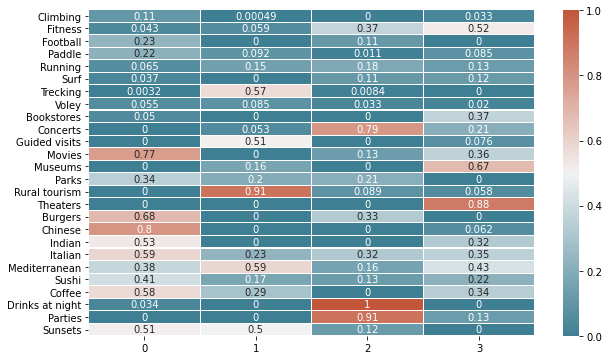
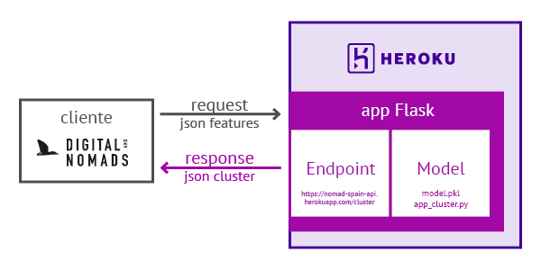
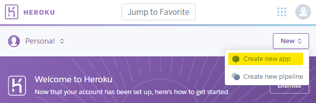
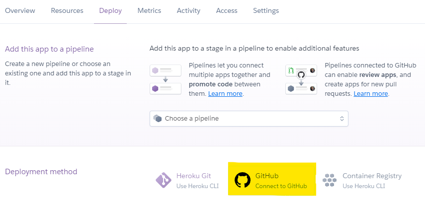
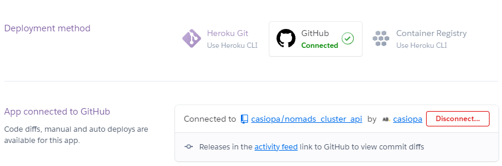
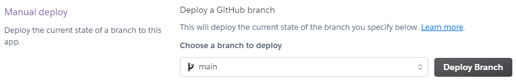

# API-Cluster de usuarios para app DigitalAndNomads
 
La app *DigitalAndNomads* requería de un servicio que agrupara a los usuarios según sus intereses una vez hecho el registro y para ello hemos desarrollado una API que devuelve el grupo al que pertence cada usuario según sus intereses gracias a un modelo de clustering NMF.

## Creación de un entorno virtual

El primer paso es crear un entorno virtual en el que instalemos Python y las librerías necesarias para la lectura del modelo. Este paso es importante porque nos permitirá controlar qué versiones de Python y librerías se deben instalar en la máquina de Heroku. Esta información la volcaremos posteriormente en los archivos `runtime.txt` y `requirements.txt`. Una forma de crear el entorno virtual es utilizando conda, para lo que ejecutamos en la terminal:

```
conda create --name nombre_entorno
conda activate nombre_entorno
```

Más opciones para la creación y activación de entornos virtuales con Conda [aquí](https://conda.io/projects/conda/en/latest/user-guide/tasks/manage-environments.html#activating-an-environment).


## Modelo de clustering NMF
Para entrenar el modelo que segmentara los usuarios en grupos con intereses afines realizamos una encuesta anónima que contestaron 115 personas. La información recogida está disponible en este [archivo csv](https://github.com/casiopa/nomads_cluster_api/blob/549ce8faac7ede42cf06cc4dc6e908c3c5656634/model/N%C3%B3madas%20digitales%20y%20viajeros%20incondicionales%20(Responses)%20-%20Form%20Responses%202.csv).

Realizamos un `one-hot-encoding` de las variables obteniendo un dataFrame con 26 variables o columnas. El resultado fue una matriz dispersa con un grado de sparsity de casi el 70%. Por ello escogimos el algoritmo de factorización matricial no negativa o NMF (`Non-negative matrix factorization`) para realizar el clustering de usuarios.

En la siguiente imagen podemos ver los valores asignados por el algoritmo a cada interés de los usuarios para cada segmento.



Si escogemos los valores más altos para cada segmento nos hacemos una buena idea los intereses asociados:
- Segmento 0: Chinese food, Burgers, Movies, Italian food, Coffee, Indian food
- Segmento 1: Rural tourism, Mediterranean food, Trecking, Visitas guiadas
- Segmento 2: Drinks at nigth, Parties, Concerts
- Segmento 3: Theaters, Museums, Fitness, Bookstores, Movies

El preprocesado de la encuesta y el entrenado del modelo pueden verse en este notebook: [NomDig_NMF.ipynb](model\NomDig_NMF.ipynb)

## Puesta en producción del modelo NMF de clustering con Flask y Heroku

Un vez entrenado el modelo lo exportamos como objeto pickle y ya podemos empezar a crear la API que dará el servicio. El proceso se activará en el momento en el que usuario, de manera opcional, rellena un formulario con sus intereses para que la aplicación le asigne un sala de chat con usuarios de intereses relacionados y que se encuentren en la misma ciudad.

En este caso montaremos un endpoint al que la app *DigitalAndNomads* haga una petición POST enviando los datos del usuario como un objeto JSON. Este JSON lo recibe la aplicación Flask alojada en Heroku, con esos datos el modelo hace la predicción y se devuelve otro JSON con el cluster adjudicado.



Para un mínimo producto viable el alojamiento gratuito de la APP en Heroku puede resultar la mejor opción aunque hay que tener en cuenta que tras 30 minutos de inactividad la aplicación entra en modo reposo y que tenemos un límite de 512MB de RAM.

### Creación de la app
Nuestra app Flask está en el archivo `app_cluster.py` cuyo código es el siguiente:
```
from flask import Flask, request, jsonify
from flask_cors import CORS, cross_origin
from joblib import load
import pandas as pd


app = Flask(__name__)
cors = CORS(app)
app.config['CORS_HEADERS'] = 'Content-Type'

model = load('model/model.pkl')


@app.route('/', methods=['GET'])
def home():
	return "<h1>Nomads Spain app</h1><p>Clustering users api.</p>"


@app.route('/cluster', methods=['POST'])
@cross_origin(origin='*',headers=['Content-Type'] , methods=['POST'])
def api_cluster():
    new_user = pd.DataFrame.from_dict(request.get_json(force=True)['interests'], orient='index').T
    new_user = new_user.reindex(columns = ['climbing', 'fitness', 'football', 'paddle', 'running', 'surf',
                                        'trecking', 'volley', 'bookstores', 'concerts', 'guidedVisits',
                                        'movies', 'museums', 'parks', 'ruralTourism', 'theaters', 'burguers',
                                        'chinese', 'indian', 'italian', 'mediterranean', 'sushi', 'coffee',
                                        'drinks', 'parties', 'sunsets'])
    new_user = new_user.astype('int')
    print(new_user.columns)
    _id = request.get_json(force=True)['_id']

    cluster = int(model.transform(new_user).argmax()) + 1
    print(cluster)

    return jsonify({"_id": _id, "cluster": cluster})

if __name__ == '__main__':
    app.run()
```
#### Tips para aplicación Flask en Heroku
- `app.run()`. La ejecución de nuestra aplicación, para el despliegue en Heroku, debe hacerse dentro de la cláusula `if __name__ == '__main__':`. Heroku realiza su propia ejecución, no entra en el condicional if. Si el método `.run()` se encuentra fuera del if la aplicación no funcionará cuando se despliegue en Heroku.
- No incluyas más código que `app.run()` en `if __name__ == '__main__':`. Heroku no lo va a ejecutar.
- Recuerda preprocesar el json de entrada para que se adecúe a lo que espera el modelo. En nuestro caso tuvimos que ordenar las variables con un método `.reindex()`
- Método GET o POST. Inicialmente utilizábamos un método GET para la petición del cluster. Al hacer pruebas en local de la app funcionaba bien. Incluso al desplegar la app en Heroku y hacer pruebas con Postman funcionaba bien pero cuando el equipo de desarrollo de 'Digitals&Nomads` realizaba la petición devolvía un error 400. La solución fue cambiar el método a POST. Puede parece obvio para algunos, pero hemos encontrado ejemplos de puesta en producción que utilizan ambos métodos. En caso de error en la petición es aconsejable probar a cambiar el método a POST.


### Deploy en Heroku
La puesta en producción de una aplicación en Heroku es bastante sencilla. En primer lugar tenemos que preparar los archivos necesarios:

- `requirements.txt`: lista de dependencias de Python
```
Flask==1.1.1
gunicorn==20.0.4
numpy==1.20.3
pandas==1.2.4
requests==2.24.0
requests-oauthlib==1.3.0
scikit-learn==0.24.0
joblib==1.0.1
Flask-Cors==3.0.10
...
```
- `Procfile`: especifica qué se va a ejecutar en el entorno Heroku
```
web: gunicorn app_cluster:app
```
- `runtime.txt` (opcional): especifica la versión de Pyhton
```
python-3.8.8
```
- `app_cluster.py`: la app Flask


Lo siguiente que debemos hacer es abrir una cuenta en Heroku y crear una nueva app.



Si entramos en la página de la app recién creada y en la pestaña Deploy, veremos que tenemos 3 formas de alojar la aplicación en Heroku. En este caso utilicé *Connnect to GitHub*. De esta forma solo tenemos que enlazar la app con un repositorio que ya tengamos subido a GitHub. 



En caso de que el repositorio tenga muchos archivos que los verdaderamente necesarios para el despligue de la app será mejor utilizar la primera opción que vemos en la imagen: Heroku Git. Alojando los archivos necesarios en el Git de Heroku podemos seleccionar exactamente qué archivos subimos.



Una vez enlazada la app con nuestro repositorio en GitHub, tenemos que lanzar el deploy. Hay dos formas de hacerlo automáticamente, cada vez que se actualiza el repositorio, o manual, que se lanza clickar en el botón `Deploy Branch`. Esta última opción es la que hemos utilizamos y la que recomendamos porque se mantiene el control de cuándo se actualiza la aplicación.



### Test con Postman
Por último, ya solo nos queda probar que la API funciona. Para ello podemos usar Postman que es una aplicación con la que podremos probar la petición POST, enviando la info en JSON. También veremos el JSON que devuelve nuestra petición.

Postman se puede utilizar como aplicación web y también se puede instalar en máquina. Nosotros utilizamos la segunda opción porque nos permitió probar la app Flask en local, antes de subirla a Heroku. Si quieres acceder a Postman utiliza este enlace: [Postman on the web](https://www.postman.com/) y si queires descargar Postman app: [Download Postman](https://www.postman.com/downloads/)


Una vez que está todo probado solo queda testarlo junto con el equipo de desarrollo que consulta la API. Suele haber alguna cosa que limar. En nuestro caso, el modelo devolvía el número de cluster incluyendo el cero. Los clusters posibles eran: `[0-3]`. Desarrollo nos pidió no hubiera ceros, así que tuvimos que sumar uno a la salida del modelo, para tener un rango de clusters posibles de `[1-4]`. Pocos cambios ;) 


### Referencias:
- [Productionize a Machine Learning model with Flask and Heroku](https://towardsdatascience.com/productionize-a-machine-learning-model-with-flask-and-heroku-8201260503d2)
- [Serving a model with Flask](https://guillaumegenthial.github.io/serving.html)
- [Aceptando el cuerpo de una petición JSON](https://gitnacho.github.io/Silex/cookbook/json_request_body.html)
